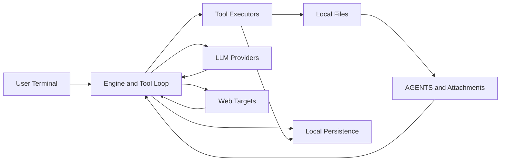

# Forge Threat Model

## Executive summary
Forge is a local single-user TUI/CLI that brokers untrusted prompt/context inputs into privileged local tools and outbound LLM/web requests; the top risks are prompt-injection-driven misuse of tool capabilities, local data exposure through persisted history/journals/config, and policy weakening through local config changes. Stock controls are strong in several places (default balanced approvals, `Run` denylisted by default, sandbox deny patterns, owner-only persistence, redaction, and outbound URL/network guards), so the highest-priority issues are abuse paths that rely on user confirmation quality, configuration drift, or local host compromise rather than unauthenticated remote attack.

## Scope and assumptions
- In-scope paths: `cli/`, `core/`, `engine/`, `tools/`, `providers/`, `context/`, `config/`, `utils/`, `types/`.
- Out-of-scope: CI/CD and release workflow hardening (`.github/`, most of `docs/CI_RUNBOOK.md`), test-only behavior (`tests/`), and custom forks/plugins not in this repo.
- Confirmed context (user provided): single user on consumer machines, stock Forge behavior, no sync/share of history/session/plan/journal files.
- Assumptions that influence ranking:
- No inbound network service is exposed by Forge; attack surface is local inputs plus outbound requests.
- Threats requiring multi-user separation failures are downgraded because deployment is single-user.
- `tools.approval` and `tools.sandbox` are not manually weakened from defaults.
- Open questions that would materially change ranking:
- None currently; risk rankings would shift up if shared hosts, custom tool integrations, or relaxed policy defaults are introduced.

## System model
### Primary components
- CLI/TUI runtime: `cli/src/main.rs` initializes `forge_engine::App` and runs the input/tick/render loop.
- Prompt assembly and AGENTS injection: `core/src/environment.rs` discovers and concatenates AGENTS files (64 KiB cap), and `core/src/env_context.rs` injects AGENTS content into the first outgoing message.
- Input/send pipeline: `engine/src/app/input_modes.rs` validates drafts, expands `@file` references under sandbox/size/UTF-8 constraints, and queues messages.
- Tool orchestration and approvals: `engine/src/app/tool_loop.rs` and `engine/src/app/plan.rs` validate schemas/limits, enforce deny/allow lists, and move calls through approval/execution phases.
- Tool implementations and sandboxing: `tools/src/builtins.rs`, `tools/src/sandbox.rs`, `tools/src/webfetch/*`, `tools/src/git.rs`, and `tools/src/command_blacklist.rs`.
- Provider networking: `providers/src/lib.rs` dispatches provider requests over HTTPS-only clients and parses SSE streams with bounds.
- Local persistence and recovery: `engine/src/app/persistence.rs`, `context/src/stream_journal.rs`, and `context/src/tool_journal.rs` persist and recover session/history/tool state.
- Config and redaction: `config/src/lib.rs` loads/persists config and keys, and `utils/src/security.rs` sanitizes secrets before display/journaling.

### Data flows and trust boundaries
- User terminal -> input pipeline (`engine/src/app/input_modes.rs`): prompt text, slash commands, and `@file` tokens cross from user-controlled terminal input into engine state; controls include non-empty checks, API-key gating, and file-read caps/UTF-8 checks.
- Filesystem (`AGENTS.md`, repo files) -> system/user prompt assembly (`core/src/environment.rs`, `core/src/env_context.rs`, `engine/src/app/input_modes.rs`): attacker-controlled repo text can enter model context; controls include AGENTS 64 KiB truncation, sandbox path resolution, deny patterns, and truncation limits for attachments.
- Model tool calls -> tool planner/executor (`engine/src/app/tool_loop.rs`): untrusted model outputs become structured tool requests; controls include schema validation, batch/arg/patch size limits, denylist checks, preflight sandbox checks, and approval workflow.
- Engine -> local OS/files (`tools/src/sandbox.rs`, `tools/src/builtins.rs`, `tools/src/git.rs`): tool operations touch filesystem and subprocess boundaries; controls include sandbox allow roots, deny patterns, unsafe path rejection, command blacklist, and policy modes.
- Engine -> external provider APIs (`providers/src/lib.rs`, `providers/src/claude.rs`, `providers/src/openai.rs`, `providers/src/gemini.rs`): prompts/history/tool outputs are sent over HTTPS with provider-specific auth headers; controls include HTTPS-only client, no redirects, bounded SSE parsing, and retry policy.
- Engine -> external web targets (`tools/src/webfetch/http.rs`): URL fetch requests cross into internet content; controls include scheme validation (`http/https`), internal-IP/CIDR blocking, allowed-port checks, redirect revalidation, and response size/content-type limits.
- Engine -> local persistence (`engine/src/app/persistence.rs`, `engine/src/app/init.rs`, `context/src/*journal.rs`): conversation/tool artifacts are stored on disk; controls include secure directory setup, atomic writes, owner-only persistence mode, and crash-recovery journaling.

#### Diagram

## Assets and security objectives
| Asset | Why it matters | Security objective (C/I/A) |
|---|---|---|
| API keys in config/env (`config/src/lib.rs`) | Key theft enables provider-account abuse and indirect data access. | C, I |
| Conversation history/session/plan/journals (`engine/src/app/persistence.rs`, `context/src/*journal.rs`) | Contains user prompts, tool outputs, and operational state that may include sensitive data. | C, I |
| Workspace/repo files | Integrity loss can silently alter code/config; confidentiality loss may expose proprietary data. | C, I |
| Tool execution authority (Run/Git/Edit/Write/WebFetch) | Primary privilege boundary between model suggestions and host actions. | I, A |
| Approval policy and sandbox configuration (`engine/src/app/init.rs`) | Misconfiguration can weaken or remove core safety gates. | I |
| Availability of engine/provider stream loop (`providers/src/lib.rs`, `engine/src/app/tool_loop.rs`) | Disruption blocks user workflows and can corrupt session continuity if recovery fails. | A |
| Redaction pipeline (`utils/src/security.rs`) | Prevents accidental credential leakage in UI, logs, and journals. | C |

## Attacker model
### Capabilities
- Can control repository content opened by the user (including local `AGENTS.md`, prompt text in files, and links) and attempt prompt injection.
- Can host malicious web content reachable by WebFetch.
- Can influence user confirmation decisions via misleading instructions/social engineering.
- Can execute with local user-level access if endpoint malware compromises the machine (important for consumer endpoints).

### Non-capabilities
- No direct remote network access to a Forge server process (no inbound service assumed).
- No cross-tenant or multi-user boundary to exploit in scoped deployment.
- No custom provider/tool backends beyond stock Forge behavior.
- Cannot bypass explicit approval and denylist checks without either config changes, local compromise, or user action.

## Entry points and attack surfaces
| Surface | How reached | Trust boundary | Notes | Evidence (repo path / symbol) |
|---|---|---|---|---|
| User draft send | Keyboard input in insert mode | User terminal -> engine | Draft validated and queued; triggers first-message AGENTS injection. | `engine/src/app/input_modes.rs` (`queue_message`) |
| AGENTS discovery/injection | Repo/global AGENTS files on disk | Filesystem -> system prompt | Concatenated and truncated to 64 KiB, consumed on first outbound message. | `core/src/environment.rs` (`discover_agents_md`, `MAX_AGENTS_MD_BYTES`), `core/src/env_context.rs` (`take_agents_md`) |
| `@file` expansion | User prompt references local paths | Filesystem -> model context | Sandbox path resolution, deny patterns, max read bytes, UTF-8 enforcement, truncation notes. | `engine/src/app/input_modes.rs` (`expand_file_references`, `read_file_reference_content`) |
| Tool call batch intake | Provider/model returns tool calls | Model output -> local executor | Schema validation, denylist, size limits, sandbox preflight, approval mode handling. | `engine/src/app/tool_loop.rs` (`plan_tool_calls`) |
| Approval and plan state transitions | User approval UI actions | User decision -> privileged execution | Approval requests tracked and resolved before execution commit. | `engine/src/state.rs` (`ApprovalState`, `PlanApprovalState`), `engine/src/app/plan.rs` (`resolve_plan_approval`) |
| WebFetch URL fetch | Tool argument `url` | Engine -> internet target | Blocks internal CIDRs/ports and revalidates redirects; bounded response parsing. | `tools/src/webfetch/http.rs` (`validate_url`, `fetch`) |
| Provider streaming responses | Outbound API requests to model providers | Engine -> external APIs | HTTPS-only client, no redirects, bounded SSE parser with idle timeout and buffer caps. | `providers/src/lib.rs` (`http_client`, `sse_stream_events`) |
| Config/env loading | Startup/load config | Local config/env -> runtime policy | Approval mode defaults to balanced; default allowlist/denylist shape is security critical. | `engine/src/app/init.rs` (`parse_approval_mode`, policy construction), `config/src/lib.rs` (`expand_env_vars`) |
| Crash recovery replay | Startup after interruption | Journals -> active session | Recovers stream/tool journal state and rehydrates history. | `engine/src/app/persistence.rs` (`check_crash_recovery`) |

## Top abuse paths
1. Prompt-injection from repo content -> malicious `AGENTS.md` or file text is loaded into prompt context -> model proposes data-harvesting tool calls -> user approves call(s) -> sensitive local content is sent to remote provider endpoints.
2. Socially engineered command execution (conditional) -> attacker prompt persuades user to loosen policy (remove default `Run` denylist) -> model requests `Run` with destructive/exfil commands -> user approves confirmation -> local integrity/availability compromise.
3. Web exfiltration via approved fetch -> attacker convinces user/model to fetch attacker URL carrying encoded instructions -> fetched content steers later tool calls and output shaping -> user-approved operations leak additional local context.
4. Local config tampering -> malware edits `~/.forge/config.toml` to permissive approval or weak sandbox roots -> subsequent sessions execute broader tool actions with less friction -> persistent integrity and confidentiality risk.
5. Sensitive context persistence exposure -> user prompts/tool outputs include secrets -> data persists in history/session/journals under local data dir -> local compromise or backup leakage exposes long-lived sensitive traces.
6. Recovery-path poisoning -> interrupted run leaves partial journal state -> crafted/malicious partial tool text is recovered into active history -> follow-on reasoning consumes poisoned context and triggers risky actions.
7. Availability degradation -> attacker-controlled content causes repeated oversized/invalid tool calls or problematic streams -> queue stalls, repeated errors, and degraded user interaction until manual intervention.

## Threat model table
| Threat ID | Threat source | Prerequisites | Threat action | Impact | Impacted assets | Existing controls (evidence) | Gaps | Recommended mitigations | Detection ideas | Likelihood | Impact severity | Priority |
|---|---|---|---|---|---|---|---|---|---|---|---|---|
| TM-001 | Malicious repo content/prompt injection | User opens untrusted repo content and sends prompts in same session. | Inject instructions via `AGENTS.md` or attached file text to steer tool usage and exfiltrate data via provider requests. | Confidential data leakage and unsafe local actions. | API keys, repo data, journals, tool authority. | AGENTS 64 KiB cap and first-send consumption (`core/src/environment.rs`, `core/src/env_context.rs`); approval pipeline and tool planning gates (`engine/src/app/tool_loop.rs`). | Prompt origin trust is not explicit in UX; users may approve high-risk actions under social pressure. | Add trust-zone labeling for AGENTS/attachments in approval UI; add optional “untrusted-repo mode” that forces strict approvals and blocks side-effect tools until explicit opt-in; add per-turn provenance tags on model instructions. | Alert on bursts of approval requests immediately after AGENTS load; log provenance of instructions that led to approved calls. | High | High | high |
| TM-002 | Social engineering + configuration drift | User or local process changes stock policy (e.g., remove `Run` from denylist or permissive mode). | Trigger command execution through `Run` for data theft or destructive filesystem actions. | Local integrity and availability compromise; possible credential theft. | Workspace integrity, local system state, secrets. | Default denylist includes `Run` and default mode is balanced (`engine/src/app/init.rs`); blacklist patterns (`tools/src/command_blacklist.rs`); approvals (`engine/src/app/tool_loop.rs`). | Once policy is weakened, risk rises quickly; blacklist cannot cover all harmful commands. | Add signed/locked policy profile for consumer mode; require explicit interactive re-auth/confirm to remove `Run` denylist; show persistent “policy weakened” banner. | Emit high-severity event when denylist/approval mode deviates from defaults; track `Run` request/approval ratio. | Medium | High | high |
| TM-003 | Local malware or same-user process access | Endpoint compromise at user privilege level. | Read `history/session/plan` and journal DBs to extract sensitive prompts/tool outputs. | Confidentiality loss of past interactions and potentially secrets embedded in prompts. | History/session/plan files, stream/tool journals, config values. | Owner-only secure dir setup and sensitive atomic writes (`engine/src/app/init.rs`, `engine/src/app/persistence.rs`); redaction pipeline for many display/journal paths (`utils/src/security.rs`, `context/src/*journal.rs`). | Host-level same-user compromise bypasses app-level ownership controls; user-entered secrets may still persist in history. | Add optional encrypted-at-rest local store with OS keystore; add retention limits and one-click secure purge; default warning when prompt appears to include credentials. | Detect spikes in history/journal read operations where feasible; add “sensitive content persisted” telemetry counters. | Medium | Medium | medium |
| TM-004 | Malicious or malformed persisted recovery state | Crash/interruption occurs with partial journal/tool output present. | Poison recovered context to influence subsequent model/tool decisions. | Integrity impact on future actions and user trust. | Session integrity, plan integrity, user decision quality. | Ordered commit/prune semantics and recovery coordination (`engine/src/app/persistence.rs`); journal sanitization (`context/src/stream_journal.rs`, `context/src/tool_journal.rs`). | Recovered content is still context for subsequent reasoning; provenance may be unclear to users. | Mark recovered fragments with stronger visual provenance; require confirmation before executing side-effect tools when recent recovery artifacts are present. | Log tool actions executed within N turns of recovery events; alert on unusual recovered-text volume. | Medium | Medium | medium |
| TM-005 | Attacker-controlled remote content (web/provider stream) | User/model triggers fetch or provider stream includes hostile/noisy content. | Cause resource pressure and workflow degradation through large/noisy payload behavior. | Reduced availability and degraded UX; potential data loss if repeated interruptions. | App availability, interaction continuity. | SSE idle timeout, parse/error caps, buffer and body truncation (`providers/src/lib.rs`); WebFetch size/content/redirect limits (`tools/src/webfetch/http.rs`, `tools/src/webfetch/types.rs`). | Coordinated low-rate abuse can still create repeated interruptions and operator fatigue. | Add adaptive backoff/circuit-breaker per origin; expose per-origin failure counters in UI to block noisy endpoints quickly. | Track repeated stream parse failures and WebFetch limit hits by domain/provider. | Medium | Low | medium |
| TM-006 | SSRF-like destination abuse through WebFetch (conditional) | User explicitly enables insecure overrides / custom CIDRs or ports. | Fetch internal or restricted network targets, then relay content into model context. | Confidentiality breach of local/internal metadata services. | Network-reachable metadata, local/internal service data. | Default blocked CIDRs and allowed ports with redirect revalidation (`tools/src/webfetch/http.rs`, `tools/src/webfetch/resolved.rs`); insecure overrides require config plus env flags. | Security depends on safe defaults remaining unchanged; overrides can be risky when misunderstood. | Require explicit runtime warning and one-time signed acknowledgment when insecure webfetch overrides are active; add policy test on startup. | Startup alert if insecure overrides enabled; log every request to private/loopback ranges (if permitted). | Low | High | medium |
| TM-007 | Silent policy confusion around approval semantics | User expects all tools to prompt but allowlist/effect rules differ by mode/tool. | Approves or overlooks requests under mistaken understanding of what is auto-allowed. | Integrity and confidentiality mistakes from human factors. | Tool authority, workspace data. | Explicit approval-mode logic and tool metadata (`engine/src/app/tool_loop.rs`, `tools/src/lib.rs`, `tools/src/builtins.rs`); default allowlist currently includes `Read` (`engine/src/app/init.rs`). | Mental model mismatch can lead to over-trust and unsafe workflows. | Provide concise per-tool “will prompt / will auto-run” panel tied to current mode and policy; add session-start policy summary. | Track user reversals/aborts after approvals as a usability-risk signal; log mode changes. | Medium | Medium | medium |

## Criticality calibration
- Critical for this repo/context:
- Definition: direct compromise of local host or irreversible data exfil/integrity loss with little or no user mediation under stock assumptions.
- Examples: bypass of approval+denylist allowing unattended `Run`; forced exposure of API keys from config without local compromise; sandbox escape permitting unrestricted filesystem writes.
- High for this repo/context:
- Definition: likely abuse paths that depend on user interaction or moderate preconditions but can produce serious confidentiality/integrity impact.
- Examples: prompt-injection-driven approved data exfil (TM-001); policy weakening followed by harmful command execution (TM-002); enabling insecure WebFetch overrides in risky environments (TM-006).
- Medium for this repo/context:
- Definition: meaningful but bounded impact or requiring stronger preconditions (local compromise, repeated operator mistakes, sustained abuse).
- Examples: journal/history disclosure after endpoint compromise (TM-003); recovery-context poisoning (TM-004); repeated remote payload disruptions (TM-005); approval-model confusion (TM-007).
- Low for this repo/context:
- Definition: low-impact or high-precondition issues with strong existing controls and limited blast radius.
- Examples: noisy but contained parse failures that do not alter state; blocked internal fetch attempts under default WebFetch policy; denied tool calls due to default denylist/limits.

## Focus paths for security review
| Path | Why it matters | Related Threat IDs |
|---|---|---|
| `core/src/environment.rs` | AGENTS discovery/order/truncation determines prompt-injection leverage. | TM-001 |
| `core/src/env_context.rs` | First-message AGENTS injection and replay behavior affect instruction provenance. | TM-001, TM-004 |
| `engine/src/app/input_modes.rs` | Draft queueing and `@file` expansion define major untrusted input boundary. | TM-001, TM-003 |
| `engine/src/app/tool_loop.rs` | Central gate for denylist, limits, approval decisions, and execution flow. | TM-002, TM-007 |
| `engine/src/app/plan.rs` | Plan approval transitions influence when privileged batches execute. | TM-001, TM-007 |
| `engine/src/app/init.rs` | Security defaults for approval mode, allowlist/denylist, sandbox, and data dir. | TM-002, TM-006, TM-007 |
| `tools/src/sandbox.rs` | Filesystem boundary enforcement and deny-pattern handling. | TM-002, TM-003 |
| `tools/src/command_blacklist.rs` | Last-line guard against destructive command patterns when `Run` enabled. | TM-002 |
| `tools/src/webfetch/http.rs` | URL validation, CIDR/port checks, redirect, and response-boundary controls. | TM-006, TM-005 |
| `tools/src/webfetch/resolved.rs` | Override and env-gated webfetch policy resolution. | TM-006 |
| `providers/src/lib.rs` | HTTPS-only client config, SSE bounds, retries, and error-path handling. | TM-005 |
| `context/src/stream_journal.rs` | Persistence and sanitization for streamed model output. | TM-003, TM-004 |
| `context/src/tool_journal.rs` | Tool argument/output persistence and redaction boundaries. | TM-003, TM-004 |
| `engine/src/app/persistence.rs` | Commit/prune ordering and crash recovery logic drive integrity guarantees. | TM-004 |
| `config/src/lib.rs` | API key handling, env expansion, and secure config persistence. | TM-002, TM-003 |
| `utils/src/security.rs` | Redaction coverage and false-negative risk for secrets in UI/journals. | TM-003 |

## Quality check
- Entry points covered: yes (terminal input, AGENTS/files, tool-call intake, approvals, web/provider networking, persistence/recovery).
- Each trust boundary represented in threats: yes.
- Runtime vs CI/dev separation: yes (CI/dev marked out-of-scope).
- User clarifications reflected: yes (single-user consumer machine, stock behavior, no sync/share).
- Assumptions and conditional conclusions explicit: yes (notably TM-002 and TM-006).
