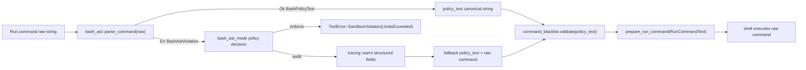

# Bash AST Hardening Plan (Implementation-Ready Spec)

## Objective

Define an executable implementation spec for Bash-family command normalization in `Run` so blacklist and run-sandbox policy checks operate on canonical, parser-derived intent where possible.

This document resolves prior architectural ambiguities and is normative for implementation.

## DESIGN.md Conformance (Normative)

1. Boundary collapse: parser boundary code must collapse uncertainty immediately into `Result<BashPolicyText, BashAstViolation>`.
2. Mechanism/policy split: `bash_ast` reports facts (`BashPolicyText`) or typed violations (`BashAstViolation`) only; caller policy decides allow/deny/log.
3. ADT violations only: unsupported syntax is modeled as enum variants and matched exhaustively.
4. No hidden fallback policy in parser: parser must never silently return raw command text on parse failure.
5. Policy is outside parser: `off | audit | enforce` behavior is implemented in `tools/src/builtins.rs`.

## Runtime Config Contract (Normative)

### TOML location

`bash_ast_mode` lives under `[tools.run]`, not `[run]`.

```toml
[tools.run]
bash_ast_mode = "off" # off | audit | enforce
```

### Parse and wiring path

1. `config/src/lib.rs`:
Add `bash_ast_mode` to `RunConfig` and deserialize to a typed enum at config boundary.
2. `engine/src/app/init.rs`:
Map parsed config value into tool runtime settings when building `ToolSettings`.
3. `tools/src/lib.rs` and `tools/src/builtins.rs`:
Carry typed mode into `RunCommandTool` and apply mode in `RunCommandTool::execute`.

### Default behavior

If `bash_ast_mode` is absent, default is `off`.

### Planned config/runtime types

```rust
// config/src/lib.rs
#[derive(Debug, Clone, Copy, Default, Deserialize, PartialEq, Eq)]
#[serde(rename_all = "snake_case")]
pub enum BashAstMode {
    #[default]
    Off,
    Audit,
    Enforce,
}

#[derive(Debug, Default, Deserialize)]
pub struct RunConfig {
    pub bash_ast_mode: Option<BashAstMode>,
    pub windows: Option<WindowsRunConfig>,
    pub macos: Option<MacOsRunConfig>,
}
```

```rust
// tools/src/lib.rs (runtime-facing copy mapped in engine init)
#[derive(Debug, Clone, Copy, Default, PartialEq, Eq)]
pub enum BashAstMode {
    #[default]
    Off,
    Audit,
    Enforce,
}
```

## RunCommandText Contract (Resolved)

Implementation must keep the current borrowed integration contract in `tools/src/windows_run.rs`:

```rust
pub(crate) fn new(raw: &str, policy_text: &str) -> RunCommandText<'_>
```

No move-consumption API change is part of this phase. The plan must preserve borrowed `&str` call sites.

## Parser Boundary Contract (Normative)

### Input contract

1. Input type is Rust `&str` (UTF-8 by construction).
2. Hard cap: input length must be `<= 64 * 1024` bytes.
3. Exactly one parse attempt per command string.
4. No parser retries, no secondary parser, no "best effort" text transforms after parse failure.

### Output contract

1. Return `Ok(BashPolicyText)` iff command is exactly one simple literal command in allowed subset.
2. Return `Err(BashAstViolation::<variant>)` for all unsupported or ambiguous forms.
3. Parser output excludes parser-internal diagnostics from policy layers.
4. Only `BashPolicyText` and `BashAstViolation` cross parser boundary.

### Core parser types

```rust
pub(crate) struct BashPolicyText {
    command: NonEmptyString,
    args: Vec<String>,
}

pub(crate) enum BashAstViolation {
    InputTooLarge,
    ParseError,
    MultipleStatements,
    PipelineNotSupported,
    RedirectionNotSupported,
    HereDocNotSupported,
    CompoundCommandNotSupported,
    SubshellNotSupported,
    CommandSubstitutionNotSupported,
    ParameterExpansionNotSupported,
    ArithmeticExpansionNotSupported,
    ProcessSubstitutionNotSupported,
    NonLiteralWordNotSupported,
    AssignmentPrefixNotSupported,
}
```

## Supported Syntax Subset (Phase 1)

### Accepted

1. Exactly one simple command.
2. Literal command word.
3. Literal arguments only.
4. Quoted literal arguments if no runtime expansion is required.

### Rejected

1. Multi-statement forms (`;`, `&&`, `||`, newline-separated command lists).
2. Pipelines.
3. Redirections and heredocs.
4. Compound commands (`if`, `for`, `while`, `case`, function defs, brace groups).
5. Subshells.
6. Command substitution (`$(...)`, backticks).
7. Parameter expansion and arithmetic expansion.
8. Process substitution.
9. Assignment prefixes (`FOO=bar cmd`).

## Canonicalization Algorithm (Normative)

Apply in strict order:

1. Validate input byte length (`InputTooLarge` on overflow).
2. Parse once using `tree-sitter` + `tree-sitter-bash`.
3. If parse tree has error/missing nodes, return `ParseError`.
4. Validate exactly one top-level simple command (`MultipleStatements` otherwise).
5. Reject structural disallowed forms before token normalization:
   pipeline, redirection/heredoc, compound, subshell.
6. Reject assignment-prefix forms (`AssignmentPrefixNotSupported`).
7. Validate command word is literal (`NonLiteralWordNotSupported` if not).
8. Validate each argument token with deterministic violation mapping table below.
9. NFKC-normalize command and args.
10. Lowercase command token only.
11. Emit canonical policy string by single-space join of normalized command and args.

Non-goals for Phase 1:

1. No runtime shell expansion.
2. No command substitution semantics.
3. No redirection semantics.
4. No attempt to preserve shell quoting semantics beyond literal token extraction.

## Violation Mapping Rules (Normative)

### Deterministic precedence

When multiple unsupported constructs are present, return first violation according to this precedence order:

1. `InputTooLarge`
2. `ParseError`
3. `MultipleStatements`
4. `PipelineNotSupported`
5. `HereDocNotSupported`
6. `RedirectionNotSupported`
7. `CompoundCommandNotSupported`
8. `SubshellNotSupported`
9. `AssignmentPrefixNotSupported`
10. `CommandSubstitutionNotSupported`
11. `ProcessSubstitutionNotSupported`
12. `ParameterExpansionNotSupported`
13. `ArithmeticExpansionNotSupported`
14. `NonLiteralWordNotSupported`

### Node-to-violation table

| Syntax observation | Violation |
|---|---|
| input bytes > 65536 | `InputTooLarge` |
| parse error or missing node | `ParseError` |
| more than one top-level statement | `MultipleStatements` |
| pipeline with `|` or multiple pipeline elements | `PipelineNotSupported` |
| heredoc/here-string node | `HereDocNotSupported` |
| any non-heredoc redirection node | `RedirectionNotSupported` |
| `if/for/while/case/function/brace-group` nodes | `CompoundCommandNotSupported` |
| subshell node `( ... )` | `SubshellNotSupported` |
| leading `NAME=VALUE` assignments before command | `AssignmentPrefixNotSupported` |
| command substitution node or backtick form | `CommandSubstitutionNotSupported` |
| process substitution `<(...)` or `>(...)` | `ProcessSubstitutionNotSupported` |
| `$VAR` or `${...}` | `ParameterExpansionNotSupported` |
| `$((...))` | `ArithmeticExpansionNotSupported` |
| any remaining non-literal command/arg token | `NonLiteralWordNotSupported` |

### Enforce-mode message mapping

Enforce mode must map each violation to a stable denial code string and fixed user-facing message template:

```text
Run rejected unsupported Bash syntax (<code>). Enforce mode permits only one literal command with literal arguments.
```

`<code>` is a stable snake_case string derived from `BashAstViolation`.

## Integration Contract in Run Path (Normative)

Integrate in `tools/src/builtins.rs` within `RunCommandTool::execute`:

1. Parse tool args into `RunCommandArgs`.
2. Determine shell family by executable stem.
3. Compute policy text:
   - PowerShell path remains as-is.
   - Bash-family path uses `bash_ast_mode` and parser result.
   - Non-Bash-family path uses raw command text.
4. Validate blacklist with selected policy text.
5. Pass raw command and selected policy text to `RunCommandText::new(&str, &str)`.
6. Preserve raw command for spawn execution.

### Borrowed integration pattern

```rust
let raw = typed.command.as_str();
let mut policy_text_buf: Option<String> = None;

if is_bash_family_shell(&self.shell) && !matches!(self.bash_ast_mode, BashAstMode::Off) {
    match bash_ast::parse_command(raw) {
        Ok(policy) => policy_text_buf = Some(policy.to_policy_string()),
        Err(v) => match self.bash_ast_mode {
            BashAstMode::Audit => {
                log_bash_ast_audit(v, &self.shell, raw.len());
                policy_text_buf = Some(raw.to_string());
            }
            BashAstMode::Enforce => return Err(bash_ast_enforce_error(v)),
            BashAstMode::Off => unreachable!(),
        },
    }
}

let policy_text = policy_text_buf.as_deref().unwrap_or(raw);
ctx.command_blacklist.validate(policy_text)?;
let command_text = RunCommandText::new(raw, policy_text);
```

### Shell detection strategy

Use executable stem matching, consistent with existing `is_powershell_shell` style in `tools/src/windows_run.rs`:

1. Extract `file_stem` from `DetectedShell.binary`.
2. Lowercase ASCII stem.
3. Treat `bash | sh | dash | zsh` as Bash-family in Phase 1.

### Audit telemetry (privacy-bounded)

In audit mode on parser violation, emit structured warning fields only:

1. `violation_kind`
2. `shell_name`
3. `command_length_bytes`
4. `mode` (always `"audit"`)

Do not log:

1. raw command text
2. canonical policy text
3. parser token payloads

## Decisions (Resolved) and Deferred Scope

### Resolved for this phase

1. `zsh` is treated as Bash-family by shell-stem matching.
2. Assignment prefixes are rejected in Phase 1.
3. Mode is global under `[tools.run]`.
4. Telemetry is minimal and privacy-bounded as defined above.
5. `RunCommandText` stays borrowed (`&str`, `&str`).

### Deferred to Phase 4 (strict no-change guarantee for earlier phases)

1. Redirection support.
2. Assignment prefix support.
3. Multi-command support.
4. Per-profile or per-tool override policies.

Phases 1-3 must not alter deferred semantics.

## File Changes and Ownership

| File | Required change |
|---|---|
| `Cargo.toml` | Add `tree-sitter` and `tree-sitter-bash` under `[workspace.dependencies]` |
| `tools/Cargo.toml` | Consume `tree-sitter.workspace = true` and `tree-sitter-bash.workspace = true` |
| `tools/src/bash_ast.rs` (new) | Parser boundary, canonicalization, violation mapping |
| `tools/src/lib.rs` | Export `bash_ast` module and runtime `BashAstMode` type |
| `config/src/lib.rs` | Add config `BashAstMode` and `[tools.run].bash_ast_mode` |
| `engine/src/app/init.rs` | Map config mode into tool runtime settings |
| `tools/src/builtins.rs` | Mode-aware integration and policy boundary decisions |
| `tools/src/windows_run.rs` | Keep `RunCommandText` borrowed contract (no ownership API change) |
| `docs/SECURITY_SANITIZATION.md` | Document parser boundary and telemetry restrictions |
| `docs/FORGE_THREAT_MODEL.md` | Add control evidence and residual risk notes |

Ownership statement:

1. Parser and canonicalization mechanism belong in `tools/src/bash_ast.rs`.
2. Policy decisions belong in `tools/src/builtins.rs`.
3. Execution shaping remains in `tools/src/windows_run.rs`.

## Runtime Flow



## Testing and Evidence Matrix

### Unit tests (`tools/src/bash_ast.rs`)

1. Allowed literal command and args.
2. One test per `BashAstViolation` variant.
3. Precedence determinism tests when multiple violations coexist.
4. Canonicalization tests:
   quoted literals, escaped literals, whitespace normalization, unicode NFKC normalization, confusable command tokens.
5. Input-size boundary tests:
   exactly 64 KiB accepted path and 64 KiB + 1 rejected path.

### Integration tests (`tools/src/builtins.rs`)

1. `audit` mode logs violation and continues to blacklist/spawn path.
2. `enforce` mode blocks before spawn.
3. Blacklist receives canonical AST text when parse succeeds.
4. Blacklist receives raw text fallback only in `audit` parser-failure path.
5. `off` mode preserves pre-existing raw policy behavior.

### Regression requirements

1. No behavior change to PowerShell AST path (`tools/src/powershell_ast.rs`).
2. Existing Windows run-sandbox tests remain green.
3. Existing command-blacklist tests remain green.

### Validation commands

1. `just fix`
2. `just verify`

## Rollout, Rollback, and Migration

### Migration

1. No config migration required.
2. Feature is opt-in with default `off`.

### Rollback

Immediate rollback is config-only:

```toml
[tools.run]
bash_ast_mode = "off"
```

### Rollout gate to recommend `audit -> enforce`

Require all of the following:

1. violation rate below 0.5% of Bash-family `Run` invocations for 14 consecutive days.
2. zero confirmed severity-high false-positive incidents in that window.
3. unit/integration matrix fully green in CI.

## Implementation Completion Criteria

This plan is implementation-ready only if all conditions are met:

1. No unresolved architectural questions remain in this document.
2. All config examples map to concrete structs and runtime wiring.
3. Every violation class has deterministic trigger conditions and tests.
4. Parser boundary, policy boundary, and telemetry privacy boundary are explicitly separated.
5. Rollout, rollback, and migration guidance are concrete and immediately actionable.
6. `DESIGN.md` contract language is encoded as normative requirements.
